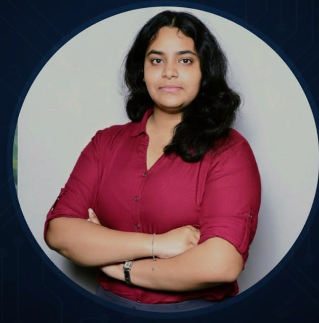

<h1 align="center">Hey, I'm Amisha 👋</h1>
<h3 align="center">CSE Undergraduate | Learning by Building</h3>

 

  

 

  

---

## ✨ About Me
- 🎓 CSE student  
- 💻 Learning through hands-on coding  
- 🌱 Focused on consistency over motivation  
- 🧠 Interested in Python & AI/ML  

---

## 🛠 Tech Stack

  

---

## 📊 GitHub Stats

  

  

  

---

## 🚀 Projects

---
## 🤝 Connect With Me
- GitHub: https://github.com/aviatrix999
- LinkedIn: www.linkedin.com/in/amisha-patel-481917376

  Learning quietly. Building steadily.

